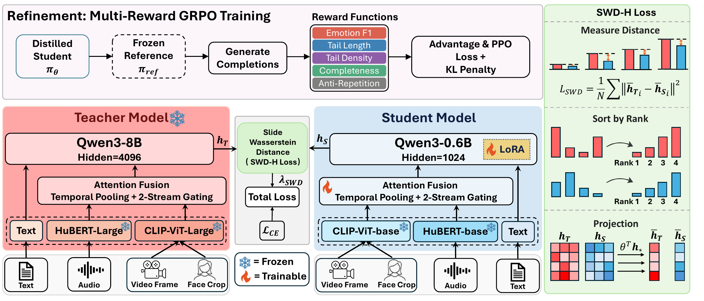

# Light-MER

Official implementation for the paper:

**Do We Really Need Multimodal Emotion Language Models Larger Than 1B Parameters?**

<p align="center">
  
</p>

> Light-MER codebase for Stage 1 SWD-H distillation and Stage 2 M-GRPO refinement.

Light-MER revisits generative multimodal emotion recognition (MER) from an efficiency perspective. Instead of deploying a large 7B/8B multimodal emotion language model, Light-MER transfers the multimodal emotion reasoning ability of a strong teacher into a sub-1B deployment model.

This repository hosts the Light-MER open-source release, covering the Stage 1 SWD-H distillation pipeline and the Stage 2 M-GRPO refinement track. Stage 1 is available now, and future updates will expand the same codebase according to the roadmap below.

## 📰 News

- **July 06, 2026**: README and public config aligned with the Light-MER paper; core model source is included in the release.
- **July 05, 2026**: Stage 1 SWD-H training, inference, and evaluation code released.
- **Coming Soon**: Stage 2 M-GRPO refinement code and instructions.

## 🚦 Release Status

| Component | Status | Notes |
|---|---|---|
| Stage 1 | Released | SWD-H distillation code for Qwen3-8B teacher to Qwen3-0.6B student |
| Stage 2 | COMING SOON | M-GRPO refinement will be released in a future update |
| Evaluation | Released | Inference scripts, label extraction, and Emotion Wheel metrics |
| Model Checkpoint | PARTIALLY RELEASED | Teacher checkpoint released; student checkpoints coming soon |
| Codex Skill | COMING SOON | A lightweight Codex helper for running Light-MER workflows |

## 🧠 Method Overview

Light-MER compresses a Qwen3-8B multimodal emotion teacher into a Qwen3-0.6B deployable student. Stage 1 uses SWD-H to align answer-token hidden-state geometry, while Stage 2 follows the M-GRPO refinement track for more concise and emotion-faithful generation.

<p align="center">
  
</p>

## 🧩 Model Configuration

| Role | Language decoder | Visual encoder | Audio encoder |
|---|---|---|---|
| Teacher | Qwen3-8B | CLIP-ViT-Large-Patch14 | HuBERT-Large |
| Student | Qwen3-0.6B | CLIP-ViT-Base-Patch16 | HuBERT-Base |

The paper uses face-cropped visual inputs because facial regions carry salient affective cues. The current configs expose the same multimodal data path through `face_or_frame: "multiface_audio_face_text"`.

## ⚡ Efficiency Snapshot

Light-MER keeps the multimodal emotion reasoning pipeline compact: the Qwen3-0.6B student uses about **11x fewer FLOPs** and **2.54 GB peak memory**, while preserving the same MER generation interface.

| Model | Scale | Efficiency | Direct output | Descriptive output |
|---|---:|---:|---:|---:|
| Teacher (Qwen3-8B) | 9.00B params<br>20.04 GB peak | 10,902.6G FLOPs<br>baseline | 0.901s / sample<br>9.5 words / sample | 6.138s / sample<br>104.4 words / sample |
| **Student SWD-H (Qwen3-0.6B)** | **854.93M params**<br>**2.54 GB peak** | **988.8G FLOPs**<br>**11.0x smaller** | **0.561s / sample**<br>8.5 words / sample | **4.621s / sample**<br>110.5 words / sample |
| **Student M-GRPO (Qwen3-0.6B)** | **854.93M params**<br>**2.54 GB peak** | **988.8G FLOPs**<br>**11.0x smaller** | **0.523s / sample**<br>7.9 words / sample | **3.105s / sample**<br>70.8 words / sample |

## 📐 SWD-H Settings

Canonical config:

```text
train_configs/stage1_swdh_qwen3_8b_to_qwen3_0_6b.yaml
```

Main SWD-H settings:

```yaml
model:
  teacher:
    use_swd: True
    swd_n_projections: 100
    swd_p: 2
    ot_weight: 1.0
    ot_ramp_steps: 5000
    kl_weight: 0.0
```

When `use_swd=True`, the implementation projects teacher hidden states from 4096 to the student hidden size 1024 with a frozen orthogonal teacher projection, and compares them with the student 1024-dimensional hidden states. The SWD-H mask is aligned with the cross-entropy answer-token mask.

## 📁 Directory Layout

```text
.
├── train.py
├── inference_hybird.py
├── eval_student_model.py
├── config.py
├── train_configs/
│   ├── stage1_teacher_qwen3_8b.yaml
│   └── stage1_swdh_qwen3_8b_to_qwen3_0_6b.yaml
├── scripts/
│   ├── train_teacher_qwen3_8b.sh
│   ├── train_stage1_swdh.sh
│   ├── inference_stage1_swdh.sh
│   ├── eval_stage1_swdh.py
│   └── eval_stage1_swdh.sh
├── my_affectgpt/
│   ├── models/
│   ├── datasets/
│   ├── runners/
│   └── tasks/
├── toolkit/
├── emotion_wheel/
├── requirements.txt
└── environment.yml
```

## ⚙️ Installation

Create a conda environment:

```bash
conda env create -f environment.yml
conda activate swdh-stage1
```

or install with pip:

```bash
python -m venv .venv
source .venv/bin/activate
pip install -r requirements.txt
```

The original Stage 1 experiments used an H100 80GB GPU. Smaller GPUs may require reducing batch size, sequence length, or enabling additional memory optimizations.

## 📦 Dataset

### 📝 MER-Caption+

Stage 1 training uses MER-Caption+ from the MER2025 release:

- Download: [MERChallenge/MER2025](https://huggingface.co/datasets/MERChallenge/MER2025)

Expected layout:

```text
dataset/
└── mer2025-dataset/
    ├── video/
    ├── audio/
    ├── openface_face/
    ├── subtitle_chieng.csv
    ├── track2_train_mercaptionplus.csv
    └── track3_train_mercaptionplus.csv
```

### 🧪 MER-UniBench

Evaluation follows the MER-UniBench setting, covering basic emotion recognition, sentiment analysis, and open-vocabulary MER.

- MER2023/MER2024/SIMS/SIMS v2/CMU-MOSI/CMU-MOSEI/IEMOCAP/MELD: [Baidu Netdisk](https://pan.baidu.com/s/1kbfs5pG_hAri0QwvQl-Ecg?pwd=b9vn) / [TeraBox](https://1024terabox.com/s/1AE7uAU3Ib8aRBSyF1TMpow)
- OV-MERD+: [Baidu Netdisk](https://pan.baidu.com/s/1nBTw_ujSTQPAMyIs5Qv8Zw?pwd=k8tj) / [TeraBox](https://1024terabox.com/s/1O130fc81FVsGGsrjLuHyDA)

Expected layout:

```text
dataset/
├── mer2023-dataset-process/
├── mer2024-dataset-process/
├── meld-process/
├── iemocap-process/
├── cmumosi-process/
├── cmumosei-process/
├── sims-process/
├── simsv2-process/
└── ovmerdplus-process/
```

## 🤖 Model Zoo

### 🧱 General Checkpoints

Place or symlink pretrained models under `models/`, or set `SWDH_MODEL_ROOT`.

| Model | Type | Used for | Link |
|---|---|---|---|
| Qwen3-8B | LLM | Teacher decoder | [Hugging Face](https://huggingface.co/Qwen/Qwen3-8B) |
| Qwen3-0.6B | LLM | Student decoder | [Hugging Face](https://huggingface.co/Qwen/Qwen3-0.6B) |
| Qwen2.5-7B-Instruct | LLM | Evaluation label extraction | [Hugging Face](https://huggingface.co/Qwen/Qwen2.5-7B-Instruct) |
| CLIP-ViT-Large-Patch14 | Visual Encoder | Teacher visual encoder | [Hugging Face](https://huggingface.co/openai/clip-vit-large-patch14) |
| CLIP-ViT-Base-Patch16 | Visual Encoder | Student visual encoder | [Hugging Face](https://huggingface.co/openai/clip-vit-base-patch16) |
| Chinese HuBERT-Large | Audio Encoder | Teacher audio encoder | [Hugging Face](https://huggingface.co/TencentGameMate/chinese-hubert-large) |
| Chinese HuBERT-Base | Audio Encoder | Student audio encoder | [Hugging Face](https://huggingface.co/TencentGameMate/chinese-hubert-base) |

Expected layout:

```text
models/
├── Qwen3-8B/
├── Qwen3-0.6B/
├── Qwen2.5-7B-Instruct/
├── clip-vit-large-patch14/
├── clip-vit-base-patch16/
├── chinese-hubert-large/
└── chinese-hubert-base/
```

### 🏁 Light-MER Checkpoints

| Model Name | Description | Link |
|---|---|---|
| Light-MER Teacher | Qwen3-8B teacher checkpoint | [Hugging Face](https://huggingface.co/kevin233333/Light-MER/blob/main/light-mer-teacher-qwen3-8b.pth) |
| Light-MER Stage 1 SWD-H | Qwen3-0.6B student after SWD-H distillation | |
| Light-MER Stage 2 M-GRPO | Final student after M-GRPO refinement | |

## 🚀 Getting Started

### 🧑‍🏫 1. Train the Qwen3-8B Teacher

Skip this step if you already have a compatible teacher checkpoint.

```bash
CONDA_ENV_NAME=swdh-stage1 bash scripts/train_teacher_qwen3_8b.sh
```

After selecting the teacher checkpoint, copy or symlink it to:

```text
checkpoints/qwen3_8b_teacher.pth
```

### 🎓 2. Train the Qwen3-0.6B SWD-H Student

```bash
CONDA_ENV_NAME=swdh-stage1 \
TEACHER_CKPT=checkpoints/qwen3_8b_teacher.pth \
bash scripts/train_stage1_swdh.sh
```

### 🔮 3. Run Inference

```bash
CKPT_ROOT=output/stage1_swdh_qwen3_8b_to_qwen3_0_6b/<run_dir> \
TEST_EPOCHS=5-60 \
SKIP_EPOCH=5 \
bash scripts/inference_stage1_swdh.sh
```

Use `TEST_EPOCH=60` to run one checkpoint.

### 📊 4. Evaluate

```bash
bash scripts/eval_stage1_swdh.sh \
  --base-root output_stage1_swdh_qwen3_8b_to_qwen3_0_6b/results
```

## 🛠️ Path Overrides

You can override default roots without editing source files:

```bash
export SWDH_MODEL_ROOT=/path/to/models
export SWDH_DATASET_ROOT=/path/to/dataset
export SWDH_EMOTION_WHEEL_ROOT=/path/to/emotion_wheel
export SWDH_RESULT_ROOT=/path/to/results
```

You can override YAML values directly:

```bash
python -u train.py \
  --cfg-path train_configs/stage1_swdh_qwen3_8b_to_qwen3_0_6b.yaml \
  --options model.teacher.ckpt=/path/to/qwen3_8b_teacher.pth
```

## 📚 Citation

The paper is currently represented here by its title. Citation metadata will be updated after the public paper/arXiv/camera-ready version is available.

```bibtex
@misc{lightmer2026,
  title = {Do We Really Need Multimodal Emotion Language Models Larger Than 1B Parameters?},
  year = {2026},
  note = {Code: https://github.com/kevinkke233-maker/Light-MER}
}
```

## 📄 License

This project is released under the [Apache License 2.0](LICENSE). Please also follow the licenses and usage terms of the external datasets, pretrained models, and checkpoints used with this codebase.

## 🙏 Acknowledgement

This codebase builds on AffectGPT-style multimodal instruction tuning and open-source components from the PyTorch, Hugging Face Transformers, vLLM, CLIP, HuBERT, BLIP/LAVIS, and ImageBind ecosystems.
