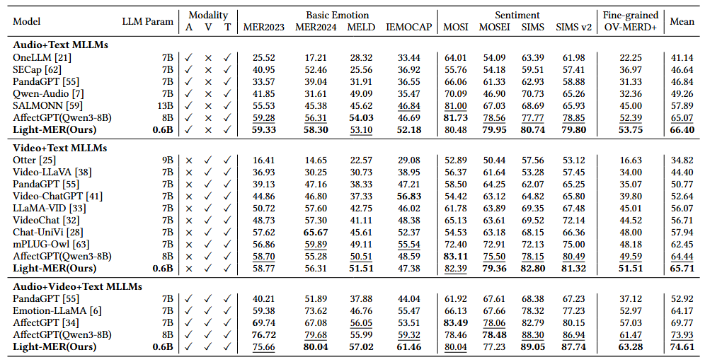

# Light-MER

Official implementation for the paper:

**Do We Really Need Multimodal Emotion Language Models Larger Than 1B Parameters?**

<p align="center">🌟 If this project helps or inspires your research, please consider giving us a star! ⭐</p>

<p align="center">
  <a href="https://arxiv.org/abs/2607.12787"></a>
  <a href="https://pytorch.org/"></a>
  <a href="https://www.python.org/"></a>
  <a href="https://huggingface.co/kevin233333/Light-MER"></a>
  <a href="LICENSE"></a>
</p>

<p align="center">
  
</p>

> Light-MER codebase for Stage 1 SWD-H distillation and Stage 2 M-GRPO refinement.

Light-MER revisits generative multimodal emotion recognition (MER) from an efficiency perspective. Instead of deploying a large 7B/8B multimodal emotion language model, Light-MER transfers the multimodal emotion reasoning ability of a strong teacher into a sub-1B deployment model.

This repository hosts the Light-MER open-source release, covering the Stage 1 SWD-H distillation pipeline and the Stage 2 M-GRPO refinement track. Stage 1 is available now, and future updates will expand the same codebase according to the roadmap below.

## 📰 News

- **July 14, 2026**: Stage 1 SWD-H student checkpoints and Stage 1 agent skills released.
- **July 14, 2026**: README and public config aligned with the Light-MER paper; core model source is included in the release.
- **July 14, 2026**: Stage 1 SWD-H training, inference, and evaluation code released.
- **July 10, 2026**: 🎉 Our paper **Do We Really Need Multimodal Emotion Language Models Larger Than 1B Parameters?** was accepted by the **ACM MM 2026 Main Track**.

**TODO list sorted by priority**

- [x] Release Stage 1 SWD-H training, inference, and evaluation code. (Completed on July 14, 2026)
- [x] Release Light-MER teacher and Stage 1 SWD-H student checkpoints. (Completed on July 14, 2026)
- [x] Release Codex and Claude Code Stage 1 deployment skills. (Completed on July 14, 2026)
- [ ] Release Stage 2 M-GRPO refinement code and instructions. (Coming soon)
- [ ] Release Stage 2 M-GRPO checkpoint. (Coming soon)
- [ ] Release additional reproducibility notes and benchmark logs. (Coming soon)

**If you encounter any questions or discover a bug within the paper or code, please do not hesitate to open an issue or submit a pull request.**

## 🚦 Release Status

| Component | Status | Notes |
|---|---|---|
| Stage 1 | Released | SWD-H distillation code for Qwen3-8B teacher to Qwen3-0.6B student |
| Stage 2 | COMING SOON | M-GRPO refinement will be released in a future update |
| Evaluation | Released | Inference scripts, label extraction, and Emotion Wheel metrics |
| Model Checkpoint | PARTIALLY RELEASED | Teacher and Stage 1 SWD-H checkpoints released; Stage 2 checkpoint coming soon |
| AI Agent Skills | Released | Codex and Claude Code helpers with Stage 1 train, inference, and evaluation preflight checks |

## 🛠️ AI Agent Skills

Stage 1 deployment helpers are included for both Codex and Claude Code. After installation, start the skill with one prompt; if no workflow is specified, the skill opens a Stage 1 menu and then automatically checks required checkpoints, pretrained models, datasets, config files, and inference outputs before running project scripts.

<details>
<summary><strong>Codex</strong></summary>

Install:

```bash
git clone https://github.com/GAIR-Lab/Light-MER.git
mkdir -p ~/.codex/skills
cp -r Light-MER/codex/skills/light-mer ~/.codex/skills/
```

After installation, open a new Codex session and invoke the installed Light-MER skill. Codex will open a Stage 1 menu for inference, training, or evaluation. The preflight checker runs inside the selected workflow. If anything is missing, Codex asks for the missing local paths and deploys them with symlinks or environment variables.

</details>

<details>
<summary><strong>Claude Code</strong></summary>

Install:

```bash
git clone https://github.com/GAIR-Lab/Light-MER.git
mkdir -p ~/.claude/skills
cp -r Light-MER/claude-code/skills/light-mer ~/.claude/skills/
```

After installation, invoke the installed Light-MER skill in Claude Code. Claude Code will open a Stage 1 menu for inference, training, or evaluation. The preflight checker runs inside the selected workflow. If anything is missing, Claude Code asks for the missing local paths and deploys them with symlinks or environment variables.

</details>

Status: **Released for Stage 1**. Stage 2 support will be added with the M-GRPO release.

## 🧠 Method Overview

Light-MER compresses a Qwen3-8B multimodal emotion teacher into a Qwen3-0.6B deployable student. Stage 1 uses SWD-H to align answer-token hidden-state geometry, while Stage 2 follows the M-GRPO refinement track for more concise and emotion-faithful generation.

<p align="center">
  
</p>

## 🧩 Model Configuration

| Role | Language decoder | Visual encoder | Audio encoder |
|---|---|---|---|
| Teacher | Qwen3-8B | CLIP-ViT-Large-Patch14 | HuBERT-Large |
| Student | Qwen3-0.6B | CLIP-ViT-Base-Patch16 | HuBERT-Base |

The paper uses face-cropped visual inputs because facial regions carry salient affective cues. The current configs expose the same multimodal data path through `face_or_frame: "multiface_audio_face_text"`.

## ⚡ Efficiency Snapshot

Light-MER keeps the multimodal emotion reasoning pipeline compact: the Qwen3-0.6B student uses about **11x fewer FLOPs** and **2.54 GB peak memory**, while preserving the same MER generation interface.

| Model | Params | Peak Mem. | FLOPs | Direct | Descriptive |
|---|---:|---:|---:|---:|---:|
| Teacher | 9.00B | 20.04 GB | 10,902.6G | 0.901s | 6.138s |
| **SWD&#8209;H Student** | **854.93M** | **2.54 GB** | **988.8G (11.0x)** | **0.561s** | **4.621s** |
| **M&#8209;GRPO Student** | **854.93M** | **2.54 GB** | **988.8G (11.0x)** | **0.523s** | **3.105s** |

Direct and descriptive columns report latency per sample.

## ⚙️ Installation

Create a conda environment:

```bash
conda env create -f environment.yml
conda activate swdh-stage1
```

or install with pip:

```bash
python -m venv .venv
source .venv/bin/activate
pip install -r requirements.txt
```

The original Stage 1 experiments used an H100 80GB GPU. Smaller GPUs may require reducing batch size, sequence length, or enabling additional memory optimizations.

## 📦 Dataset

### 📝 MER-Caption+

Stage 1 training uses MER-Caption+ from the MER2025 release:

- Download: [MERChallenge/MER2025](https://huggingface.co/datasets/MERChallenge/MER2025)

Expected layout:

```text
dataset/
└── mer2025-dataset/
    ├── video/
    ├── audio/
    ├── openface_face/
    ├── subtitle_chieng.csv
    ├── track2_train_mercaptionplus.csv
    └── track3_train_mercaptionplus.csv
```

### 🧪 MER-UniBench

Evaluation follows the MER-UniBench setting, covering basic emotion recognition, sentiment analysis, and open-vocabulary MER.

- MER2023/MER2024/SIMS/SIMS v2/CMU-MOSI/CMU-MOSEI/IEMOCAP/MELD: [Baidu Netdisk](https://pan.baidu.com/s/1kbfs5pG_hAri0QwvQl-Ecg?pwd=b9vn) / [TeraBox](https://1024terabox.com/s/1AE7uAU3Ib8aRBSyF1TMpow)
- OV-MERD+: [Baidu Netdisk](https://pan.baidu.com/s/1nBTw_ujSTQPAMyIs5Qv8Zw?pwd=k8tj) / [TeraBox](https://1024terabox.com/s/1O130fc81FVsGGsrjLuHyDA)

Expected layout:

```text
dataset/
├── mer2023-dataset-process/
├── mer2024-dataset-process/
├── meld-process/
├── iemocap-process/
├── cmumosi-process/
├── cmumosei-process/
├── sims-process/
├── simsv2-process/
└── ovmerdplus-process/
```

## 🤖 Model Zoo

### 🧱 General Checkpoints

Place or symlink pretrained models under `models/`, or set `SWDH_MODEL_ROOT`.

| Model | Type | Used for | Link |
|---|---|---|---|
| Qwen3-8B | LLM | Teacher decoder | [Hugging Face](https://huggingface.co/Qwen/Qwen3-8B) |
| Qwen3-0.6B | LLM | Student decoder | [Hugging Face](https://huggingface.co/Qwen/Qwen3-0.6B) |
| Qwen2.5-7B-Instruct | LLM | Evaluation label extraction | [Hugging Face](https://huggingface.co/Qwen/Qwen2.5-7B-Instruct) |
| CLIP-ViT-Large-Patch14 | Visual Encoder | Teacher visual encoder | [Hugging Face](https://huggingface.co/openai/clip-vit-large-patch14) |
| CLIP-ViT-Base-Patch16 | Visual Encoder | Student visual encoder | [Hugging Face](https://huggingface.co/openai/clip-vit-base-patch16) |
| Chinese HuBERT-Large | Audio Encoder | Teacher audio encoder | [Hugging Face](https://huggingface.co/TencentGameMate/chinese-hubert-large) |
| Chinese HuBERT-Base | Audio Encoder | Student audio encoder | [Hugging Face](https://huggingface.co/TencentGameMate/chinese-hubert-base) |

Expected layout:

```text
models/
├── Qwen3-8B/
├── Qwen3-0.6B/
├── Qwen2.5-7B-Instruct/
├── clip-vit-large-patch14/
├── clip-vit-base-patch16/
├── chinese-hubert-large/
└── chinese-hubert-base/
```

### 🏁 Light-MER Checkpoints

| Model Name | Description | Link |
|---|---|---|
| Light-MER Teacher | Qwen3-8B teacher checkpoint | [Hugging Face](https://huggingface.co/kevin233333/Light-MER/blob/main/light-mer-teacher-qwen3-8b.pth) |
| Light-MER Stage 1 SWD-H | Qwen3-0.6B student after SWD-H distillation | [Hugging Face](https://huggingface.co/kevin233333/Light-MER/tree/main/stage1-swdh-qwen3-0.6b) |
| Light-MER Stage 2 M-GRPO | Final student after M-GRPO refinement | |

## 🚀 Getting Started

### 🧑‍🏫 1. Train the Qwen3-8B Teacher

Skip this step if you already have a compatible teacher checkpoint.

```bash
CONDA_ENV_NAME=swdh-stage1 bash scripts/train_teacher_qwen3_8b.sh
```

After selecting the teacher checkpoint, copy or symlink it to:

```text
checkpoints/qwen3_8b_teacher.pth
```

### 🎓 2. Train the Qwen3-0.6B SWD-H Student

```bash
CONDA_ENV_NAME=swdh-stage1 \
TEACHER_CKPT=checkpoints/qwen3_8b_teacher.pth \
bash scripts/train_stage1_swdh.sh
```

### 🔮 3. Run Inference

```bash
CKPT_ROOT=output/stage1_swdh_qwen3_8b_to_qwen3_0_6b/<run_dir> \
REPEAT=1 \
BASE_ROOT=output_stage1_swdh_qwen3_8b_to_qwen3_0_6b/repeat1/results \
TEST_EPOCH=60 \
bash scripts/inference_stage1_swdh.sh
```

This runs one task for one model/config, one repeat, and one epoch. The public template does not use a Slurm array by default. To run a local serial sweep, set `TEST_EPOCHS=5-60` and `SKIP_EPOCH=5` explicitly.

### 📊 4. Evaluate

```bash
bash scripts/eval_stage1_swdh.sh \
  --base-root output_stage1_swdh_qwen3_8b_to_qwen3_0_6b/repeat1/results
```

### 🏁 Expected Results

<p align="center">
  
</p>

A final variation of ±0.3% is normal because inference uses stochastic decoding.

## 🛠️ Path Overrides

You can override default roots without editing source files:

```bash
export SWDH_MODEL_ROOT=/path/to/models
export SWDH_DATASET_ROOT=/path/to/dataset
export SWDH_EMOTION_WHEEL_ROOT=/path/to/emotion_wheel
export SWDH_RESULT_ROOT=/path/to/results
```

You can override YAML values directly:

```bash
python -u train.py \
  --cfg-path train_configs/stage1_swdh_qwen3_8b_to_qwen3_0_6b.yaml \
  --options model.teacher.ckpt=/path/to/qwen3_8b_teacher.pth
```

## 📚 Citation

If you find Light-MER useful, please cite our arXiv preprint: [arXiv:2607.12787](https://arxiv.org/abs/2607.12787).

```bibtex
@misc{zheng2026lightmer,
  title = {Do We Really Need Multimodal Emotion Language Models Larger Than 1B Parameters?},
  author = {Zheng, Kaiwen and Fu, Junchen and Deng, Wenhao and Han, Hu and Jose, Joemon M. and Ge, Xuri},
  year = {2026},
  eprint = {2607.12787},
  archivePrefix = {arXiv},
  primaryClass = {cs.AI},
  url = {https://arxiv.org/abs/2607.12787},
  note = {Accepted by ACM MM 2026}
}
```

## 📄 License

This project is released under the [Apache License 2.0](LICENSE). Please also follow the licenses and usage terms of the external datasets, pretrained models, and checkpoints used with this codebase.

## 🙏 Acknowledgement

- Built on AffectGPT-style multimodal instruction tuning: [AffectGPT](https://github.com/zeroQiaoba/AffectGPT/tree/master/AffectGPT).
- Developed with [PyTorch](https://pytorch.org/) and [Hugging Face Transformers](https://github.com/huggingface/transformers).
- Uses [vLLM](https://github.com/vllm-project/vllm) for evaluation-time label extraction and efficient LLM inference.
- Uses [CLIP](https://github.com/openai/CLIP) visual encoders and HuBERT audio encoders for multimodal feature extraction.
- Reuses ideas and open-source components from [BLIP/LAVIS](https://github.com/salesforce/LAVIS) and [ImageBind](https://github.com/facebookresearch/ImageBind).
